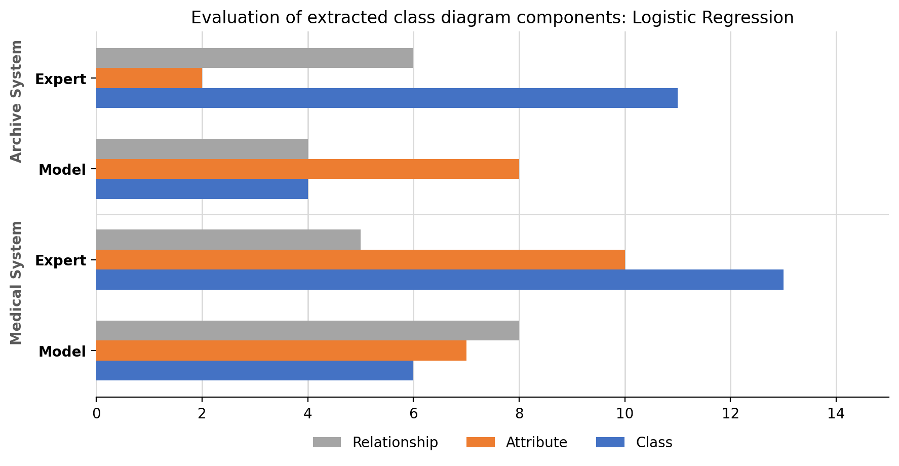
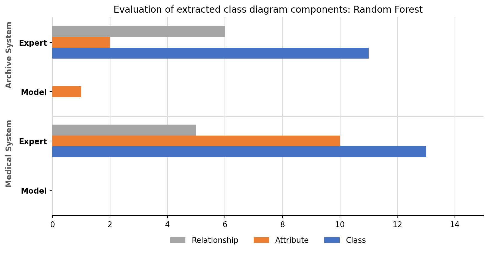
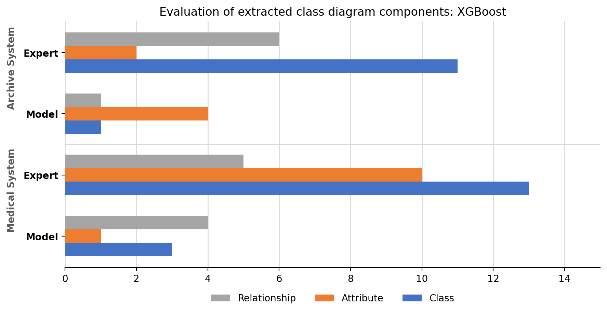

# Requirements-to-UML Model Comparison

This repository contains a reproducible machine learning experiment for extracting UML class diagram components from natural language software requirements.

The reference pipeline uses three sequential SVM sub-models. This work reproduces the same pipeline and compares three alternative classifiers:

- Logistic Regression
- Random Forest
- XGBoost

All models use the same preprocessing, feature transformation, prediction targets, train/test protocol, and evaluation metrics so that the comparison remains controlled.

## Project Structure

```text
Dataset/
  Requirements.csv
  Requirements_ProblemAnalysis.csv
  r12_problems.csv.csv
  real_world_studies.csv
  real_world_studies_template.csv

01_experiment_logistic_regression.ipynb
02_experiment_random_forest.ipynb
03_experiment_xgboost.ipynb
04_experiment_real_world_studies.ipynb

create_experiment_notebooks.py
create_real_world_notebook.py

docs/assets/
  figure5a_lr_expert_vs_model.png
  figure5b_rf_expert_vs_model.png
  figure5c_xgb_expert_vs_model.png
```

Generated outputs, trained models, paper drafts, and large binary artifacts are intentionally excluded from GitHub through `.gitignore`.

## Requirements

Use Python 3.10+ or 3.11.

Install the required packages:

```bash
pip install pandas numpy scikit-learn nltk joblib matplotlib xgboost python-docx
```

For Jupyter or VSCode Notebook execution:

```bash
pip install notebook ipykernel
```

## Experiment Workflow

Run the notebooks sequentially. It is recommended to run one notebook until completion, then shut down its kernel before starting the next notebook.

### 1. Logistic Regression

Run:

```text
01_experiment_logistic_regression.ipynb
```

Main outputs:

```text
experiment_outputs/logistic_regression/
  logistic_regression_class_attribute.joblib
  logistic_regression_class_attribute_relationship.joblib
  logistic_regression_class_class_relationship.joblib
  table3_metrics.csv
  table3_vs_svm_paper.csv
  table4_r12_model.csv
  table4_r12_vs_svm_domobot.csv
  r12_predictions.csv
  plantuml/
```

### 2. Random Forest

Shut down the Logistic Regression notebook kernel, then run:

```text
02_experiment_random_forest.ipynb
```

Main outputs:

```text
experiment_outputs/random_forest/
  random_forest_class_attribute.joblib
  random_forest_class_attribute_relationship.joblib
  random_forest_class_class_relationship.joblib
  table3_metrics.csv
  table4_r12_model.csv
  table4_r12_vs_svm_domobot.csv
```

Note: Random Forest model files can become very large, especially the `class_attribute_relationship` model.

### 3. XGBoost

Shut down the Random Forest notebook kernel, then run:

```text
03_experiment_xgboost.ipynb
```

This notebook uses an `XGBLabelEncodedClassifier` wrapper so that target labels are encoded inside each cross-validation fold. This is required because XGBoost expects contiguous numeric class indices during each `fit`.

Main outputs:

```text
experiment_outputs/xgboost/
  xgboost_class_attribute.joblib
  xgboost_class_attribute_relationship.joblib
  xgboost_class_class_relationship.joblib
  table3_metrics.csv
  table4_r12_model.csv
  table4_r12_vs_svm_domobot.csv
```

### 4. Reconstructed Real-World Studies

After the three main classifiers have been trained, run:

```text
04_experiment_real_world_studies.ipynb
```

This notebook reads:

```text
Dataset/real_world_studies.csv
```

The file contains two reconstructed real-world case studies:

- System 1: Stroke recovery assistant
- System 2: Archive space project

Important note: the original full texts of these two real-world studies were not explicitly available in the public reference artifacts. Therefore, `real_world_studies.csv` contains reconstructed case studies based on the reported system names, domains, class counts, attribute counts, relationship counts, and conceptual hints from the reference paper. These cases should not be claimed as exact reproductions of the original inputs.

Main outputs:

```text
experiment_outputs/real_world_studies/
  table5_real_world_statistics.csv
  table6_real_world_results.csv
  table6_real_world_results_by_target.csv
  figure5_expert_vs_model_counts.csv
  figure5a_lr_expert_vs_model.png
  figure5b_rf_expert_vs_model.png
  figure5c_xgb_expert_vs_model.png
```

In Figure 5, the `Expert` label refers to the manual reference annotation/proxy expert defined in `real_world_studies.csv`, not the original expert annotation from the reference paper.

## Regenerating the Notebooks

If the notebooks need to be recreated from the Python templates, run:

```bash
python create_experiment_notebooks.py
python create_real_world_notebook.py
```

The first command recreates notebooks 01-03. The second command recreates notebook 04.

## Final Results Summary

### Table 3: Main Dataset 80:20 Split

Weighted F1:

| Model | Weighted F1 |
|---|---:|
| SVM paper | 0.9200 |
| Logistic Regression | 0.9469 |
| Random Forest | 0.8905 |
| XGBoost | 0.9197 |

### Table 4: 12 Requirement Problems

Average F1:

| Model | Average F1 |
|---|---:|
| SVM paper | 85.00% |
| DoMoBOT | 84.33% |
| Logistic Regression | 94.92% |
| Random Forest | 96.19% |
| XGBoost | 90.04% |

### Reconstructed Real-World Studies

| Model | System 1 F1 | System 2 F1 |
|---|---:|---:|
| Logistic Regression | 81.25 | 66.90 |
| Random Forest | 75.44 | 63.75 |
| XGBoost | 80.96 | 64.36 |

## Example Output

The following figures show example visualizations of extracted UML class diagram components for the reconstructed real-world studies. The `Expert` rows represent the manual reference annotation/proxy expert, while the model rows represent extracted components from the trained classifiers.

### Logistic Regression



### Random Forest



### XGBoost



## Validity Notes

- Experiments 01-03 use the public dataset from the reference repository.
- The 12-problem evaluation uses `r12_problems.csv.csv`.
- The real-world study evaluation uses reconstructed case studies because the original full texts of System 1 and System 2 were not explicitly available.
- Figure 5 uses manual reference annotation/proxy expert labels, not the original expert annotations from the reference paper.
- The real-world evaluation should be described as an additional reconstructed case-study evaluation, not as an exact reproduction of the reference paper's real-world study.
